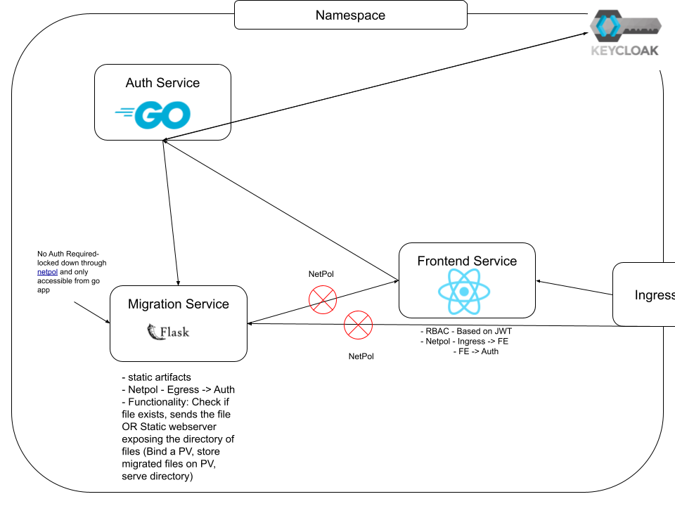

# Data Migration App POC

The idea behind this POC is to show how a _loosely coupled architecture is easier to maintain and enhance because it reduces the interdependence between components_, which makes it easier to modify or replace individual components without affecting the overall system. 

Generally, in a microservices architecture, the goal is for the services to have one major task. The "migration service" is a metaphor for the Python services that is actually doing the migration. The idea, is that services is fully locked down by network policy, not accessible by any other service other than the authentication service.

The Authentication service is spoken to via a frontend. The Authentication services exchanges credentials for JWT tokens, and relies on [middleware](auth/pkg/server/middleware.go) to enforce AUTHN-Z.

Each user will have a role in the claims of the JWT, this role will dictate what the user is authorized to see. 

**Need to haves**
- Open Telemetry - This user has an error access this data at this time. (Help us get ahead of errors)

**Nice to haves**
- Gitops Server - Nowadays manual deployment is not considered a best practice. A gitops server pointing to a repo, where the repo has CICD checks that tests, statically analyses, and builds the code before allowing the push or merge to be added to the repo is a much safer way to deploy. It will save us time and headaches.
- OpenMetrics/Prometheus Metrics would be nice to see the load the users are putting on the system at large. It could give us insights into what could be going wrong 